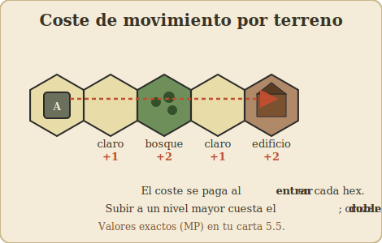
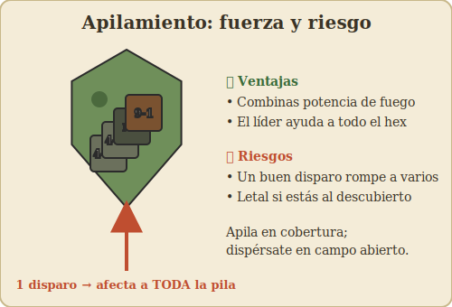

# 03 – Movimiento

[⟵ Secuencia](02-secuencia-de-juego.md) · [Índice](index.md) · [Siguiente: Fuego y combate ⟶](04-fuego-y-combate.md)

---

## Puntos de movimiento (MP)

Cada unidad dispone de un número de **puntos de movimiento (MP)** por turno. La infantería
suele tener una cantidad modesta; los vehículos, bastante más. Mover consiste en **gastar
MP para entrar en hexes**, pagando el coste del terreno del hex al que entras.

Regla de oro: **el coste se paga al ENTRAR en un hex**, no al salir. Y normalmente cuenta el
terreno del hex de destino (más, a veces, costes extra por cruzar ciertos **bordes** de hex,
como muros o setos).

Ejemplos del *tipo* de coste (los **valores exactos en MP** están en tu tabla de costes de
movimiento, regla 5.5):

| Terreno | Idea de coste | Comentario |
|---------|---------------|-----------|
| Terreno claro / trigal / cráter | Barato | Rápido pero **expuesto** al fuego |
| Carretera | Más barato aún | Veloz, pero te deja al descubierto |
| Bosque | Caro | Lento pero **protege** mucho |
| Entrar en un edificio | Caro | Excelente cobertura; clave en combate urbano |
| Moverse dentro de un edificio / escaleras | Caro por hex/nivel | El interior también cuesta |
| Subir a una elevación mayor | **Coste doble** | Las colinas se pagan caras |
| Cruzar muro / seto | Coste extra **de borde** | Penaliza el cruce, no el hex |
| Entrar en hex con humo | Coste extra | Cruzar humo te frena |
| Barranco / edificio de piedra (vehículos) | Intransitable | No se puede entrar |

> Una unidad **siempre puede mover al menos un hex** aunque no le lleguen los MP para el
> coste, salvo que el terreno sea directamente **intransitable**.

### Reglas finas de coste (las que más se olvidan)

- **Elevación:** entrar en un hex que está **un nivel más arriba** cuesta el **doble** del
  coste normal de ese terreno. Bajar no penaliza igual. Por eso atacar cuesta arriba es
  lento *y* expuesto.
- **Muros y setos:** no son el terreno del hex, son un **borde**. Pagas el coste del hex de
  destino **más** un extra por cruzar ese borde. Además, el muro/seto da **cobertura
  direccional** (ver [06 – Terreno](06-terreno-y-edificios.md)).
- **Edificios:** entrar cuesta, **y moverse de un hex a otro dentro** del edificio (o subir
  de planta) también. Tomar un edificio grande lleva su tiempo.
- **Carreteras:** moverte **a lo largo** de una carretera es muy barato — ideal para
  vehículos— pero te deja en terreno descubierto, a tiro.
- **Humo:** entrar en un hex con humo cuesta un extra; aun así suele compensar por la
  cobertura que da al cruzar.

---

## Mover una unidad de cada vez

Esto ya se dijo en la [secuencia](02-secuencia-de-juego.md), pero es tan importante que se
repite: en la fase de movimiento mueves **una unidad o pila completa de principio a fin**,
y solo entonces pasas a la siguiente. Nunca muevas "un poco con cada una a la vez".

¿Por qué? Porque el defensor reacciona **durante** ese recorrido (fuego defensivo / de
oportunidad). El orden y la ruta que elijas determinan a qué disparos te expones.

---

## Transporte: armas, líderes, cañones y vehículos

- **Armas de apoyo (SW):** una ametralladora, mortero, etc., no se mueve sola: la
  **transporta** un pelotón o un líder. Cada arma tiene un **coste de transporte (puntos de
  acarreo, PP)** que **reduce** los MP de quien la lleva. Una LMG apenas frena; una HMG es
  casi un emplazamiento fijo.
- **Líderes:** se mueven muy ágilmente y pueden **dirigir** a las unidades apiladas con
  ellos. Un líder al frente de una pila la ayuda también al moverse. Hay límites a cuántas
  armas pesadas puede arrastrar un grupo (p. ej. dos líderes pueden cargar entre ambos una
  MG media/pesada).
- **Cañones (Guns):** mover un cañón a brazo es lentísimo; normalmente se quedan donde se
  despliegan o se **remolcan** con vehículo (módulos).
- **Vehículos como transporte:** los semiorugas y camiones **cargan infantería**. Subir y
  bajar (cargar/descargar pasajeros) **cuesta MP**; descargar sobre una **carretera** sale
  más barato. Cuidado: la infantería **dentro** de un transporte sin blindar es muy
  vulnerable si el vehículo recibe fuego.

> Detalle clave de los módulos: descargar pasajeros y **luego** querer que actúen suele
> dejar poco margen ese turno. Planifica el "taxi" para soltar la tropa **a cubierto**.

---

## Apilamiento (stacking)

El **apilamiento** es cuántas unidades caben en un hex. Hay **límites** (regla 6.1). A
grandes rasgos, en el sistema clásico, por hex:

- **Infantería:** unas pocas unidades (del orden de varias escuadras como tope), **más un
  líder**.
- **Armas de apoyo:** limitadas por un total de **puntos de acarreo (PP)**.
- **Vehículos:** normalmente **uno** por hex.
- **Restos / marcadores:** sin límite.

Y hay **excepciones** donde el límite cambia (búnkeres, cuerpo a cuerpo, atrincheramientos,
2º nivel de edificios, movimiento por alcantarillas…). Consulta tu carta 6.1 para los
números exactos y la capacidad de transporte de cada vehículo.

**Ventajas de apilar:**

- **Concentras potencia de fuego** desde el mismo hex (combinas FP: mucho más letal).
- Un **líder** beneficia a **todas** las unidades de su hex (fuego, moral, reagrupamiento).

**Inconvenientes (muy importantes):**

- Un solo disparo enemigo bueno se resuelve **contra todo el hex**: puedes romper o perder
  **varias** unidades a la vez.
- Apilamiento + terreno claro = un blanco regalado.

> **Consejo de oro:** **apila en buena cobertura** (bosque, edificio) cuando quieras
> concentrar fuego y aprovechar un líder; **dispérsate** cuando cruces terreno abierto, para
> que un disparo no se lleve a todos por delante.

---

## Tipos de movimiento especiales

- **Avance (fase 7):** un solo hex, **sin provocar fuego defensivo**. Es el "último salto"
  para meterte en cobertura o entrar en contacto con el enemigo. No lo confundas con la fase
  de movimiento normal.
- **Movimiento de asalto / arrastrarse:** moverte despacio (menos hexes) para mantenerte más
  protegido o poder disparar mejor después; reglas propias en los módulos.
- **Doble tiempo / a la carrera:** gastar más para llegar lejos, a costa de ir más expuesto.
  (Detalles según edición/módulo.)

---

## Cómo pensar el movimiento (mentalidad)

1. **Antes de mover, traza la línea de visión enemiga.** ¿Quién me ve por el camino?
2. **Usa el terreno como pasarela.** Salta de cobertura en cobertura: bosque → seto →
   edificio. Evita los tramos abiertos largos.
3. **Cubre tu avance con fuego.** Que unas unidades disparen (prep fire) para **fijar** o
   romper a los defensores mientras otras avanzan.
4. **Guarda el último hex para la fase de avance**, que no provoca fuego.
5. **Humo (smoke):** si tienes morteros o capacidad de lanzar humo, ciega la línea de visión
   enemiga antes de cruzar (ver [08 – Cañones y armas de apoyo](08-canones-y-armas-de-apoyo.md)).
6. **No subas de frente una colina** si puedes rodearla: el coste doble por elevación y la
   exposición te machacan.

---

[⟵ Secuencia](02-secuencia-de-juego.md) · [Índice](index.md) · [Siguiente: Fuego y combate ⟶](04-fuego-y-combate.md)
