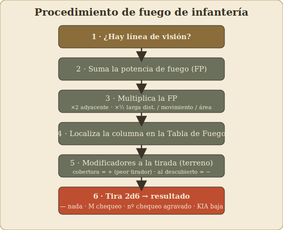

# 04 – Fuego y combate (infantería)

[⟵ Movimiento](03-movimiento.md) · [Índice](index.md) · [Siguiente: Moral y liderazgo ⟶](05-moral-y-liderazgo.md)

---

## La idea: no se "mata" directo, se rompe la moral

Lo primero que sorprende a quien viene de otros wargames: en *Squad Leader* el fuego de
infantería rara vez **elimina** unidades de golpe. Lo normal es que el fuego provoque un
**chequeo de moral** en el objetivo, y el resultado de ese chequeo decide si la unidad
aguanta, queda **inmovilizada**, se **rompe** (huye) o es **eliminada**.

Es decir: el fuego sirve sobre todo para **suprimir** y **desmoralizar** al enemigo, abrir
huecos y dejarlo incapaz de reaccionar, para luego rematar con maniobra y cuerpo a cuerpo.

---

## Procedimiento de un disparo de infantería

Sigue siempre estos pasos. (Los **números exactos** —columnas, modificadores— están en tu
Tabla de Fuego y tu tabla de modificadores; aquí va el método.)

### Paso 1 — ¿Hay línea de visión?

Comprueba la **línea de visión (LOS)** entre el hex que dispara y el objetivo: una línea
recta imaginaria entre los centros de ambos hexes. Si un **obstáculo** la corta
(colina más alta, bosque, edificio en medio), **no puedes disparar** (o el blanco está
"oculto"). Ver [06 – Terreno](06-terreno-y-edificios.md) para los detalles de LOS.

### Paso 2 — Suma la potencia de fuego (FP)

Suma la **potencia de fuego** de todas las unidades que disparan **juntas al mismo
objetivo desde el mismo hex** (o que combinan fuego según las reglas):

- Pelotones: su factor FP (el primer número, p. ej. el "4" de un 4-6-7).
- Armas de apoyo que usen: suman su FP (una ametralladora añade mucho).
- Varias unidades en el mismo hex pueden **combinar** su fuego en un solo ataque más potente.

> Combinar fuego es casi siempre mejor que disparar por separado: subes de columna en la
> tabla y el resultado es desproporcionadamente más letal.

### Paso 3 — Ajusta la potencia con los MULTIPLICADORES de fuego

> **Esto es lo más importante de entender bien.** En el *Squad Leader* clásico, ciertos
> factores **multiplican la potencia de fuego** (te suben o bajan de columna), y son
> **distintos** de los modificadores que afectan a la **tirada de dados** (Paso 5). No los
> mezcles.

Antes de buscar la columna, aplica a tu FP total los **multiplicadores** que correspondan
(consulta tu carta de "Modificadores del fuego", regla 10.3). Los principales:

- **Fuego adyacente** (disparas a un hex contiguo): **×2** la potencia.
- **Larga distancia** (entre tu alcance normal y el doble de tu alcance): **×½**.
- **Atacante en movimiento** (disparas en *fuego de avance*, tras haberte movido): **×½**.
- **Fuego de área** (el blanco está oculto): **×½**.

Más allá del **doble** de tu alcance, normalmente **no puedes disparar**.

> Los multiplicadores se acumulan. Ejemplo: disparar adyacente (×2) en fuego de avance (×½)
> deja la potencia igual; disparar a larga distancia en movimiento la deja a ¼.

### Paso 4 — Encuentra la columna de la Tabla de Fuego (10.3)

Con la FP total (ya multiplicada), localiza la **columna** correspondiente en la **Tabla de
Fuego de Infantería**. Las columnas van por "saltos" de potencia; tu FP cae en una de ellas.

### Paso 5 — Reúne los modificadores a la TIRADA (DRM)

Aparte de los multiplicadores del Paso 3, hay modificadores que **suman o restan a la tirada
de 2d6**. En el clásico provienen sobre todo del **efecto del terreno** (regla 11.1) y del
**mando**:

- **Terreno del objetivo:** bosque/cráter, tras seto, edificio de madera, tras muro de
  piedra, edificio de piedra... **protegen** al objetivo (modificador positivo, peor para el
  que dispara; cuanto mejor la cobertura, mayor el +).
- **Objetivo moviéndose en terreno descubierto:** **ayuda** al que dispara (modificador
  negativo).
- **Mando:** algunas situaciones de líder/dotación ajustan la tirada.

> En esta tabla, un resultado **bajo** es **peor para el objetivo**. Por eso la cobertura
> **suma** (aleja del KIA) y un blanco al descubierto en movimiento **resta**.

### Paso 6 — Tira 2d6 y lee el resultado

Tira los dos dados, aplica los DRM y cruza el resultado con la columna de FP. El resultado
será de uno de estos tipos:

- **`—` Sin efecto:** el objetivo aguanta sin inmutarse.
- **`M` Chequeo de moral:** el objetivo debe **chequear moral** normal (ver abajo).
- **Un número (p. ej. `2`):** chequeo de moral **agravado** — cuanto mayor el número, más
  difícil de pasar (el número empeora la tirada de moral del objetivo).
- **`KIA`:** baja directa — parte o todo el objetivo cae **sin** derecho a chequeo. Aparece
  en las tiradas bajas y en las columnas de mucha potencia.

---

## El chequeo de moral resultante

Cuando un disparo provoca un chequeo de moral, el **objetivo** tira 2d6 y compara con su
**moral** (el tercer número de la ficha), aplicando modificadores (un líder en el hex
ayuda; terreno expuesto puede perjudicar). En esencia:

- **Pasa el chequeo:** la unidad aguanta (quizá queda **inmovilizada/"pinned"** ese turno:
  no puede moverse ni casi disparar, pero sigue ahí).
- **Falla el chequeo:** la unidad se **rompe** (*broken*): se le da la vuelta a su cara
  rota, no puede disparar ni avanzar, y tendrá que **huir** en la fase de desbandada.
- **Falla por mucho:** la unidad es **eliminada**.

Todo el detalle de moral, ruptura, reagrupamiento y líderes está en
[05 – Moral y liderazgo](05-moral-y-liderazgo.md).

---

## Conceptos de fuego que debes dominar

### Combinar fuego vs. disparar suelto

Sumar la FP de varias unidades en un solo ataque te sube de columna y multiplica el efecto.
**Regla práctica:** concentra fuego sobre **un** objetivo y rómpelo, en vez de repartir
disparos flojos por todo el frente.

### Fuego preparado vs. fuego de avance

- **Fuego preparado (fase 2):** plena potencia, pero la unidad **no se mueve** ese turno.
- **Fuego de avance (fase 5):** la unidad que **se movió** dispara a **media potencia**.

Esta es **la decisión** de cada turno con cada unidad: ¿me quedo y disparo fuerte, o me
muevo y disparo flojo (o nada)?

### Fuego defensivo a fondo: *first fire* y *final fire*

Esta es la parte del sistema que más dudas genera en mesa, así que va con detalle. El bando
**inactivo** dispara en la fase de fuego defensivo, y lo hace en dos "modos" distintos:

**1. Primer disparo / fuego de oportunidad (*first fire*).** Mientras una unidad enemiga
**se está moviendo**, una unidad defensora puede gastar su disparo para tirarle **en el hex
que elija** de su recorrido.

- Disparar a un blanco que se **mueve por terreno descubierto** te da un modificador a
  favor (regla 11.1): es el mejor momento para cazarlo.
- Tú eliges **en qué hex** del recorrido disparas. No tienes por qué hacerlo en el primero:
  espera a que entre en el peor terreno posible para él (un claro, sin cobertura).

**2. Disparo final (*final fire*).** Disparar a unidades enemigas que **han terminado** su
movimiento a la vista, o que no se movieron.

**La regla que lo gobierna todo: el disparo se "agota".** Una unidad defensora que dispara
queda marcada y, en general, **no vuelve a disparar** ese turno enemigo (con los matices de
*first/final fire* de tu reglamento). Por eso cada disparo defensivo es una **decisión de
una sola bala**: gastarla pronto contra un blanco mediocre te deja indefenso ante el asalto
fuerte que venga después.

**Disparar te delata.** Al abrir fuego revelas tu posición y tu campo de tiro; el atacante
lo usará en su siguiente fase de avance o en su próximo turno.

**Cómo decidir cuándo disparar (guía práctica):**

| Situación del blanco | ¿Disparar ya? |
|----------------------|----------------|
| Cruza un claro, en movimiento, a buen alcance | **Sí** — es tu mejor oportunidad |
| Asoma 1 hex y vuelve a cobertura | Normalmente **no** — espera blanco mejor |
| Pila grande a la vista en terreno abierto | **Sí** — un disparo afecta a todo el hex |
| Una sola unidad de tanteo (cebo) | **No** — no malgastes tu única bala |
| El asalto final ya está adyacente | **Sí, sin duda** — es ahora o nunca |

> **Mentalidad del defensor:** tu fuego defensivo es oro y solo tienes una "ráfaga" por
> unidad. Colócate en buena cobertura, con líneas de visión sobre el terreno abierto que el
> enemigo debe cruzar, y **espera el momento de máxima exposición**.
>
> **Mentalidad del atacante:** nunca des al defensor un buen disparo gratis. Avanza por
> cobertura, **cieg­a su LOS con humo**, fíjalo con tu propio fuego, y guarda el último hex
> para la **fase de avance** (que no provoca fuego).

### Fuego de área / pequeñas armas a distancia

A largo alcance y con poca FP, lo más que harás es **hostigar** (forzar chequeos suaves).
No esperes matar; espera **fijar** al enemigo para que no maniobre.

---

## Ejemplo narrado (ilustrativo)

> Dos pelotones alemanes "4-6-7" están en un edificio, apilados con un líder "9-1". Ven a un
> pelotón soviético cruzando un trigal a 3 hexes.
>
> 1. **LOS:** despejada (el trigal no corta la visión desde el edificio elevado).
> 2. **FP combinada:** 4 + 4 = 8.
> 3. **Multiplicadores (10.3):** 3 hexes está dentro del alcance 6 (no es larga distancia),
>    no es adyacente ni disparan en movimiento → FP se queda en **8**.
> 4. **Columna:** la columna de "8" en la Tabla de Fuego.
> 5. **Modificadores a la tirada (11.1):** el objetivo se **mueve por terreno descubierto**
>    (modificador a favor del tirador). El trigal apenas le da cobertura. El líder "9-1"
>    ayuda sobre todo a la cohesión y al fuego combinado del hex. El neto, según tus cartas,
>    da un buen disparo.
> 6. **Tirada:** 2d6 ± DRM → resultado de **chequeo de moral** (una `M` o un número).
> 7. El soviético chequea su moral, falla, y **se rompe**: tendrá que huir en la fase de
>    desbandada. Los alemanes han "limpiado" el trigal sin avanzar un paso.
>
> *(Los valores numéricos exactos saldrían de tus cartas; el ejemplo ilustra el flujo.)*

---

[⟵ Movimiento](03-movimiento.md) · [Índice](index.md) · [Siguiente: Moral y liderazgo ⟶](05-moral-y-liderazgo.md)
