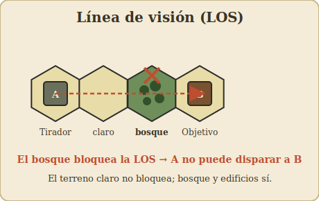
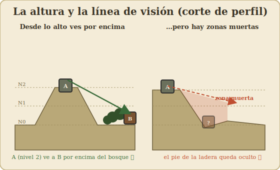
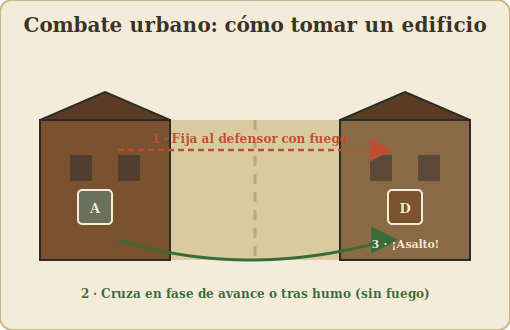
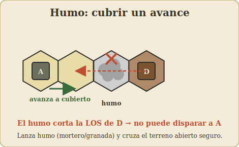

# 06 – Terreno, edificios y línea de visión

[⟵ Moral](05-moral-y-liderazgo.md) · [Índice](index.md) · [Siguiente: Blindados ⟶](07-blindados-y-vehiculos.md)

---

## El terreno hace tres cosas

Cada tipo de terreno influye en el juego de tres maneras a la vez:

1. **Coste de movimiento:** lo que cuesta **entrar** en el hex (ver [03 – Movimiento](03-movimiento.md)).
2. **Cobertura / protección:** cuánto **protege** del fuego a quien está dentro (modificador
   a favor del defensor).
3. **Línea de visión:** si **bloquea o estorba** la visión que lo atraviesa.

Un mismo hex puede ser barato y expuesto (terreno claro) o caro y protector (bosque,
edificio). Toda la táctica del juego es **moverte por lo barato-expuesto lo menos posible y
quedarte en lo protector**.

---

## Tipos de terreno (visión general)

> Los **valores numéricos** exactos (coste y modificador de cada terreno) están en tus
> cartas. Aquí va el carácter de cada uno.

| Terreno | Movimiento | Cobertura | LOS | Notas |
|---------|-----------|-----------|-----|-------|
| **Claro / abierto** | Barato | Ninguna | No bloquea | Rápido pero mortal; evita cruzarlo a la vista |
| **Trigal / maíz** | Medio | Ligera (ocultación) | Estorba algo | Te oculta pero no para balas |
| **Huerto / matorral** | Medio | Ligera | Estorba algo | Cobertura parcial |
| **Bosque** | Caro | Buena | **Bloquea** | Refugio clásico de la infantería |
| **Edificio** | Caro | Muy buena | **Bloquea** | Rey del combate urbano; ver abajo |
| **Colina (niveles)** | Caro por nivel | Según altura | **Domina** la LOS | La altura es ventaja decisiva |
| **Carretera** | Muy barato | Ninguna | No bloquea | Veloz pero expuesta; clave para vehículos |
| **Arroyo / vado** | Caro | Variable | No bloquea | Frena, puede dar algo de cobertura |
| **Muro / seto (borde)** | Coste de cruce | Cobertura direccional | Estorba a ras | Protege contra el fuego de **ese** lado |

---

## Línea de visión (LOS) en detalle

La **línea de visión** decide quién puede disparar a quién. Es, junto con la secuencia de
fases, lo que más decisiones genera.

### Cómo se traza

- Imagina una **línea recta entre los centros** del hex que dispara y el hex objetivo.
- Si esa línea **no toca** ningún obstáculo, hay LOS: puedes disparar.
- Si la línea **atraviesa** un hex que bloquea (bosque, edificio, una cresta más alta), la
  LOS está **cortada**: no puedes disparar (o el blanco está oculto).

### Obstáculos que **bloquean** vs. que **estorban**

- **Bloqueo total (blocking):** bosque, edificios, terreno más alto interpuesto. Cortan la
  visión por completo.
- **Estorbo / hindrance:** trigales, huertos, humo... no cortan la visión, pero **empeoran
  el disparo** (modificador en contra del tirador) por cada hex de estorbo que atraviesa la
  línea.

### La altura manda

Las **colinas** tienen **niveles**. Una unidad en un nivel más alto:

- **Ve por encima** de muchos obstáculos (puede tener LOS donde una unidad a ras no la
  tiene).
- Es **vista** desde lejos también (la altura es un arma de doble filo).
- El terreno entre dos puntos a distinta altura crea **ángulos** y **zonas muertas** al pie
  de las pendientes (hexes que no se ven desde arriba por estar "tapados" por la propia
  ladera).

> Dominar una cota suele ser el objetivo de medio escenario: desde arriba controlas con
> fuego todo lo que cruce abajo.

### Casos límite (cómo resolverlos)

- **La línea pasa justo por el borde entre dos hexes:** hay reglas para decidir si cuenta el
  terreno de uno, de otro o de ambos. Consulta tu reglamento; lo habitual es que si
  **cualquiera** de los dos hexes bloquea, la LOS se ve afectada.
- **Disparar desde/hacia el hex que contiene el obstáculo:** una unidad **en** el bosque o
  **en** el edificio sí puede disparar hacia fuera y ser disparada (el obstáculo es su
  propia cobertura), pero ese mismo hex bloquea la visión que intenta **atravesarlo**.

---

## Combate en edificios (urbano)

Los edificios son el terreno más importante tácticamente. Quien controla los edificios
controla el pueblo.

- **Cobertura excelente:** la infantería dentro recibe un fuerte modificador defensivo. Es
  durísimo echarla a tiros.
- **Bloquean la LOS:** crean un laberinto de líneas de visión cortas. El combate urbano es a
  bocajarro.
- **Se toman cuerpo a cuerpo:** como el fuego apenas rompe a quien está bien atrincherado en
  un edificio, a menudo hay que **entrar en su hex** (fase de avance) y resolverlo en
  **combate cuerpo a cuerpo**.
- **Plantas / niveles:** los edificios grandes pueden tener varios niveles; estar arriba da
  mejor LOS sobre las calles.
- **Riesgo de fuego (incendios):** ciertos resultados o armas (lanzallamas) pueden
  **incendiar** un edificio, que entonces se vuelve intransitable y peligroso, y el humo
  bloquea la LOS.

> **Táctica urbana básica:** fija a los defensores con fuego desde un edificio enfrentado,
> cruza la calle con humo o en la fase de avance (que no provoca fuego), y **asáltalos cuerpo
> a cuerpo**. Nunca cruces una calle abierta a la vista en fase de movimiento.

---

## Humo (smoke) y la línea de visión

El **humo** (de morteros, granadas de humo, vehículos en módulos) es la herramienta para
**negar la LOS** temporalmente:

- Un hex con humo **estorba o bloquea** la visión que lo atraviesa.
- Sirve para **cruzar terreno abierto** sin que el defensor tenga buen disparo.
- Se disipa con el tiempo (según reglas del módulo/arma).

Es la respuesta del atacante a un defensor bien colocado: si no puedes con su línea de
fuego, **ciégala**.

---

## Otros elementos de terreno (módulos)

Los módulos añaden terreno especial: **vados, puentes, terraplenes de ferrocarril,
cráteres, escombros, marismas, terreno helado/nevado** (con efectos sobre movimiento y
visión), etc. Cada escenario te dice qué hay en el mapa y, si hace falta, su efecto.

---

[⟵ Moral](05-moral-y-liderazgo.md) · [Índice](index.md) · [Siguiente: Blindados ⟶](07-blindados-y-vehiculos.md)
