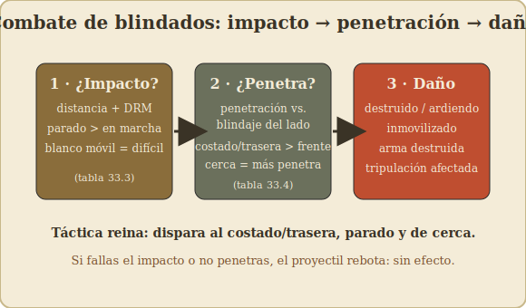
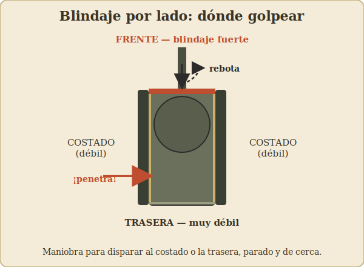

# 07 – Blindados y vehículos

[⟵ Terreno](06-terreno-y-edificios.md) · [Índice](index.md) · [Siguiente: Cañones y armas de apoyo ⟶](08-canones-y-armas-de-apoyo.md)

---

> Los blindados aparecen de forma marginal en el juego base y se desarrollan a fondo en
> **Cross of Iron** (1978) y siguientes. Si estás aprendiendo, **domina primero la
> infantería** (capítulos 02–06) antes de meter carros.

---

## Cómo se lee un vehículo

Una ficha de vehículo lleva bastante más información que un pelotón. Los datos típicos:

- **Potencia del arma principal** y su **alcance** (p. ej. un cañón de carro).
- **Factores de blindaje:** normalmente **distintos** para el **frente**, los **laterales**
  y la **trasera** (a veces también la torre vs. el casco). El frente suele estar mucho mejor
  blindado que los costados y la trasera.
- **Puntos de movimiento** (los vehículos se mueven mucho más que la infantería).
- **Armamento secundario:** ametralladoras de casco/torreta (FP antiinfantería).
- A veces, **tipo de munición**, capacidad de **humo**, **radio**, etc.

> Los valores exactos vienen en cada ficha y en las cartas de cada vehículo. Aquí explico el
> **procedimiento**, no las cifras.

---

## La gran diferencia: dos sistemas de combate

La infantería se resuelve con la Tabla de Fuego y chequeos de moral. Los **blindados usan un
sistema distinto** basado en **impactar** y **penetrar**:

1. **¿Impacto?** Primero ves si el disparo **acierta** al vehículo.
2. **¿Penetración?** Si acierta, ves si el proyectil **atraviesa** el blindaje en el lado
   golpeado.
3. **¿Daño?** Si penetra, determinas el **efecto** (inmovilizado, arma destruida, tripulación
   afectada, vehículo destruido/ardiendo...).

Vamos paso a paso.

---

## Paso 1 — Impacto (To Hit)

Para disparar un cañón antitanque o de carro contra un vehículo:

1. Comprueba la **línea de visión** (igual que la infantería).
2. Determina la **distancia** y consulta la **tabla de impacto** del arma.
3. Aplica **modificadores**: tamaño del blanco, si el blanco se movió, si **tú** te moviste
   (disparar en marcha es mucho peor), terreno/estorbo, líder/calidad de la dotación, etc.
4. Tira 2d6: o **impactas** o **fallas**.

> Principios que casi siempre se cumplen:
> - **Disparar parado** es muchísimo mejor que disparar en movimiento.
> - **A menos distancia**, más fácil impactar **y** más fácil penetrar.
> - Un **blanco que se mueve** es más difícil de acertar.

---

## Paso 2 — Penetración (To Kill / penetración del blindaje)

Si impactas, comparas la **capacidad de penetración del proyectil** a esa distancia con el
**factor de blindaje del lado golpeado**:

- **Lado golpeado:** ¿le diste de **frente**, de **costado** o por la **trasera**? Esto es
  decisivo. El mismo carro que es casi invulnerable de frente puede reventar de un disparo
  lateral.
- **Distancia:** la penetración suele **disminuir con la distancia** (a bocajarro atraviesas
  blindajes que de lejos rebotarían).
- Tiras y comparas: o **penetra**, o **rebota** (sin efecto, o efecto menor).

> De ahí la táctica reina del juego con carros: **maniobrar para disparar al costado o a la
> retaguardia** del enemigo, y hacerlo **a corta distancia y parado**. Un cañón AT bien
> emboscado en un flanco vale más que un carro potente de frente.

---

## Paso 3 — Daño

Si el proyectil penetra, determinas el efecto. Resultados típicos:

- **Destruido / ardiendo:** el vehículo queda fuera (a veces como pecio en llamas que
  bloquea LOS con humo).
- **Inmovilizado:** no se mueve, pero puede seguir disparando.
- **Arma principal o secundaria destruida.**
- **Tripulación afectada** (aturdida, baja), pudiendo abandonar el vehículo.

---

## Vehículos contra infantería (y viceversa)

### El carro disparando a la infantería

- El **arma principal** puede disparar **alto explosivo (HE)** contra infantería, usando la
  Tabla de Fuego con una FP alta.
- Las **ametralladoras** del vehículo añaden FP antiinfantería.
- Un carro suelto en campo abierto puede ser una apisonadora contra infantería expuesta...

### La infantería contra el carro (¡la infantería NO está indefensa!)

...pero la infantería tiene cómo **cazar carros**, sobre todo de cerca:

- **Armas anticarro de infantería:** **Panzerfaust** y **Panzerschreck** (alemanes),
  **bazooka** (EE. UU.), **PIAT** (británicos), fusiles AT, granadas anticarro, **cargas de
  demolición**. Muchas son de **corto alcance** pero muy letales contra los costados/trasera.
- **Asalto cuerpo a cuerpo a un carro** (close assault): la infantería en el mismo hex puede
  intentar destruir el vehículo a quemarropa (cargas, cócteles molotov, etc.), con bonus si
  el carro está **solo** (sin infantería propia que lo proteja) y según el terreno.
- **Carros "abotonados" (buttoned up):** un carro cerrado **ve mucho peor** (LOS reducida,
  peor puntería). La infantería puede acercarse por sus ángulos muertos.

> **Lección clave:** un carro **sin infantería de acompañamiento** que entra en bosque o
> pueblo es carne de cañón para la infantería emboscada. Carros e infantería deben ir
> **juntos**, protegiéndose mutuamente.

---

## Movimiento de vehículos: matices

- **Mucho MP**, pero el terreno les afecta más drásticamente: bosques y edificios pueden ser
  **intransitables**, los arroyos atascan, etc.
- **Carreteras:** baratísimas → los vehículos vuelan por carretera, pero quedan **expuestos**.
- **Disparar en movimiento** penaliza mucho el impacto; muchos vehículos prefieren parar,
  disparar y volver a moverse (o usar la fase adecuada).
- **Atascos / inmovilización:** intentar terreno difícil puede dejar el vehículo clavado.
- **Sobrepasar (overrun):** algunos vehículos pueden arrollar infantería entrando en su hex,
  con reglas propias.

---

## Tipos de vehículos que verás en los módulos

- **Carros de combate (tanks):** el grueso. Frente bien blindado, torre giratoria.
- **Cazacarros / cañones de asalto (TD / StuG, SU):** muy buen cañón, a menudo sin torre
  (tienen que orientar todo el casco para apuntar) o con blindaje desigual.
- **Semiorugas (half-tracks):** transporte de tropa con blindaje ligero; mueven infantería
  rápido pero las balas pesadas los abren.
- **Coches blindados:** rápidos, blindaje fino, buenos para reconocimiento/flancos.
- **Camiones:** transporte sin blindaje; mortales para los pasajeros si reciben fuego.
- **Cañones autopropulsados / antiaéreos:** apoyo de fuego móvil; los AA pueden ser
  demoledores contra infantería.

---

## Resumen táctico de blindados

1. **Impacta** (mejor parado y de cerca) → **penetra** (mejor por el costado/trasera) →
   **daño**.
2. El **lado** del blindaje golpeado lo es casi todo.
3. **Carros + infantería juntos.** Un carro solo en terreno cerrado muere.
4. La infantería caza carros **de cerca**, por los flancos y contra blindados "abotonados".
5. **Humo y cobertura** también valen para los vehículos: niega la LOS del cañón enemigo.

---

[⟵ Terreno](06-terreno-y-edificios.md) · [Índice](index.md) · [Siguiente: Cañones y armas de apoyo ⟶](08-canones-y-armas-de-apoyo.md)
