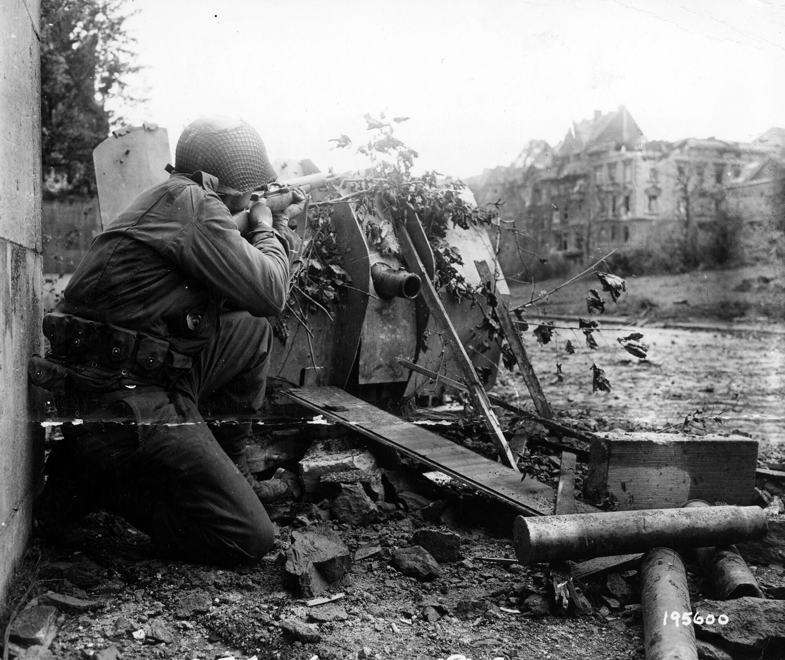

# 08 – Cañones y armas de apoyo

[⟵ Blindados](07-blindados-y-vehiculos.md) · [Índice](index.md) · [Siguiente: Módulos ⟶](09-modulos-y-reglas-avanzadas.md)

---

*Un soldado de EE. UU. se parapeta tras un cañón antitanque alemán de 47 mm fuera de combate
en Aquisgrán (19 de octubre de 1944) para apuntar a un francotirador. Foto: US Army Signal
Corps — dominio público
([Wikimedia Commons](https://commons.wikimedia.org/wiki/File:SC_195600_-_Crouching_in_the_shelter_of_a_knocked-out_German_47mm_anti-tank_gun_in_Aachen,_Germany,_Pvt._William_Zukerbrow,_Brooklyn,_N.Y.,_draws_a_bead_on_a_Nazi_sniper._19_October,_1944._%2852598394419%29.jpg)).*

Las armas pesadas son lo que convierte a un grupo de pelotones en una fuerza de combate
real. Se dividen en **armas de apoyo (Support Weapons, SW)**, que transportan los pelotones,
y **cañones (Guns)**, piezas con dotación que se despliegan en posición.

---

## Armas de apoyo (Support Weapons)

Son fichas que **no actúan solas**: las **porta y usa** un pelotón o un líder. Aportan
potencia de fuego o capacidades especiales. Cargarlas suele **frenar** a quien las lleva.

### Ametralladoras (MG)

El arma de apoyo por excelencia. Se suelen distinguir tres calibres:

- **Ligera (LMG):** la más manejable; acompaña al pelotón sin frenarlo mucho.
- **Media (MMG):** más FP y alcance; algo de penalización al moverla.
- **Pesada (HMG):** mucha FP y alcance largo; pesadísima, casi un emplazamiento fijo.

Cómo se usan:

- Suman su **FP** a la del pelotón que las dispara (ver [04 – Fuego](04-fuego-y-combate.md)).
- Tienen **alcance** propio, normalmente **largo**: dominan terreno abierto.
- Algunas pueden hacer **fuego sostenido / múltiple** sobre varios blancos o repetir disparo
  (con riesgo de **encasquillarse**: ciertos resultados de la tirada inutilizan o reparan el
  arma).
- Una **MG + líder** en buena cobertura, batiendo una zona abierta, es una de las
  combinaciones más potentes del juego.

### Morteros (Mortars)

Armas de **fuego curvo (indirecto)**: su gran virtud es que **no necesitan línea de visión
directa** del mismo modo que el fuego tenso.

- Pueden **disparar por encima** de obstáculos a blancos que el fuego directo no alcanza
  (con reglas de observación/dispersión).
- Pueden lanzar **humo** para cegar la LOS enemiga: utilísimo para cubrir avances.
- Hay morteros **ligeros** (de pelotón) y **medianos** (con dotación tipo cañón).
- Su fuego se **dispersa**: no siempre cae donde quieres (tirada de desvío).

### Lanzallamas (Flamethrowers)

- **Cortísimo alcance**, pero **brutales**: ignoran gran parte de la cobertura del objetivo
  (ideal contra infantería en edificios/búnkeres).
- Pueden **incendiar** edificios.
- Munición/uso **limitado** (riesgo de agotarse o fallar).

### Cargas de demolición (Demolition Charges)

- Se usan a **distancia cero** (hay que llegar al hex enemigo o a la fortificación).
- Demoledoras contra **búnkeres, fortificaciones y carros** en asalto cuerpo a cuerpo.

### Armas anticarro de infantería

Tratadas en [07 – Blindados](07-blindados-y-vehiculos.md): **Panzerfaust**,
**Panzerschreck**, **bazooka**, **PIAT**, fusiles AT. Corto alcance, mortales por el flanco.

---

## Cañones (Guns)

Piezas con **dotación**, más grandes y potentes, que se **despliegan** en posición. Mover un
cañón a brazo es lentísimo; se colocan donde van a combatir (o se remolcan con vehículo en
los módulos).

### Tipos principales

- **Cañones antitanque (AT / PaK):** especializados en **destruir vehículos**. Usan el
  sistema de **impacto + penetración** (ver [07](07-blindados-y-vehiculos.md)). Bien
  emboscados en un flanco, son el azote de los carros.
- **Cañones de infantería (IG):** apoyo directo; disparan **HE** contra infantería y
  posiciones.
- **Cañones antiaéreos (AA / Flak):** pensados contra aviación, pero **devastadores** usados
  en tiro horizontal contra infantería y blindaje ligero.
- **Obuses / artillería de campaña:** fuego potente; a menudo como **fuego indirecto**.

### Cómo dispara un cañón

- **Contra vehículos:** procedimiento de impacto/penetración del capítulo 07.
- **Contra infantería:** munición **HE** → Tabla de Fuego con FP alta (rompe pilas
  enteras).
- **Orientación:** muchos cañones tienen un **arco de tiro** limitado; reorientarlos cuesta
  y los deja vendidos ante un flanqueo.
- **Dotación:** si la dotación se rompe o muere, el cañón calla. Protégela.
- **Quedan revelados al disparar:** un cañón emboscado es letal el **primer** disparo;
  después el enemigo sabe dónde está. Elige bien el momento (emboscada).

---

## Fuego indirecto y artillería (módulos)

Los módulos desarrollan la **artillería fuera de mapa** y el fuego indirecto:

- **Observador (FO):** una unidad con radio/visión **solicita** fuego sobre un punto.
- **Corrección:** el primer disparo suele **desviarse**; se corrige en turnos sucesivos
  hasta caer donde quieres.
- **Barrera / concentración:** una vez ajustado, el fuego cae con gran potencia sobre el
  área.
- **Humo de artillería:** cegar amplias zonas para maniobrar.

> El fuego indirecto premia la **paciencia**: ajustas un par de turnos y luego machacas. Mal
> usado, malgastas munición disparando lejos del blanco.

---

## Fortificaciones (resumen)

Aunque no son "armas", se gestionan junto con cañones y defensa:

- **Búnkeres / casamatas:** cobertura extrema y arco de tiro; durísimos salvo por la
  espalda, lanzallamas o cargas.
- **Alambradas:** frenan y exponen a la infantería que las cruza.
- **Campos de minas:** dañan a quien entra; hay que **detectarlos/limpiarlos**.
- **Trincheras / pozos de tirador (foxholes):** mejoran la cobertura de la infantería en
  campo abierto.

---

## Resumen táctico de armas pesadas

1. **Ametralladora + líder en cobertura** batiendo terreno abierto = columna vertebral
   defensiva.
2. **Morteros** = fuego indirecto + **humo** para cubrir avances.
3. **Lanzallamas / cargas** = la respuesta a edificios y búnkeres que el fuego normal no
   desaloja.
4. **Cañones AT** = emboscada en el flanco; primer disparo decisivo.
5. **Protege siempre las dotaciones**: sin dotación, el arma calla.

---

[⟵ Blindados](07-blindados-y-vehiculos.md) · [Índice](index.md) · [Siguiente: Módulos ⟶](09-modulos-y-reglas-avanzadas.md)
