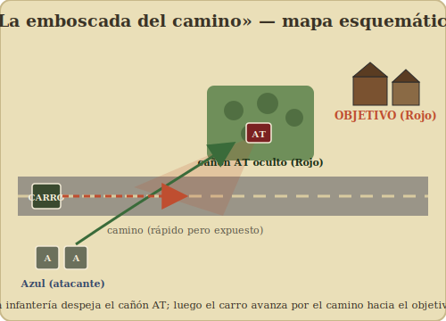

# 13b – Escenario con carro: «La emboscada del camino»

[⟵ Escenario de práctica](13-escenario-de-practica.md) · [Índice](index.md) · [Siguiente: Recursos ⟶](14-recursos-y-comunidad.md)

---

Tu **segundo escenario original**, pensado para **estrenar las reglas de blindados** sin
agobiarte: un solo carro por bando-temática, un cañón antitanque y poca infantería. Enseña
lo esencial del combate combinado: **carro + infantería juntos**, **emboscada del cañón AT**,
**disparo al flanco** y **asalto a un carro**.

> Juégalo **después** de dominar el [escenario de infantería](13-escenario-de-practica.md), y
> ten a mano el [capítulo 07 – Blindados](07-blindados-y-vehiculos.md) y el
> [08 – Cañones](08-canones-y-armas-de-apoyo.md). Ideal en [solitario](12-jugar-en-solitario.md).

---

## La situación

**Azul** (atacante) debe avanzar por un **camino** y tomar una **aldea** al final. Apoya su
infantería con **un carro**. **Rojo** (defensor) ha emboscado un **cañón antitanque** en una
arboleda que bate el camino, con algo de infantería protegiendo la aldea.

---

## Fuerzas (genéricas — usa lo que tengas)

**Azul (atacante):**

- **1 carro** (de blindaje y cañón medios; cualquiera de *Cross of Iron* en adelante).
- **2 pelotones** de infantería.
- **1 líder**.

**Rojo (defensor):**

- **1 cañón antitanque (AT)** con su dotación.
- **2 pelotones** de infantería (uno de ellos, idealmente, con un arma anticarro de
  infantería: **Panzerfaust / bazooka / PIAT**, si tu set lo trae).
- **1 líder**.

> Sin arma anticarro de infantería, da a Rojo un pelotón más: necesita algo con que frenar
> al carro si pierde el cañón.

---

## Despliegue

- **Rojo** despliega primero (oculto, si juegas con ocultación):
  - El **cañón AT** en la **arboleda** que domina el camino, orientado para batir la zona
    abierta por la que tiene que pasar el carro. Recuerda su **arco de tiro**.
  - La infantería **en y alrededor de la aldea** (objetivo), y/o un pelotón cerca del cañón
    para protegerlo del asalto.
- **Azul** entra por el **borde del camino** (lado opuesto a la aldea): el carro y los dos
  pelotones.

---

## Reglas del escenario

- **Duración:** **6 turnos**.
- **Iniciativa:** empieza **Azul**.
- Se usan las reglas de **blindados** ([cap. 07](07-blindados-y-vehiculos.md)) y **cañones**
  ([cap. 08](08-canones-y-armas-de-apoyo.md)), además de todo lo de infantería.

## Condiciones de victoria

- **Azul gana** si al final del turno 6 tiene **una unidad en buena orden (carro o pelotón)
  en la aldea** y **no** hay defensores en buena orden en ella.
- **Rojo gana** en cualquier otro caso. **Bonus moral para Rojo** si además **destruye el
  carro**: si lo logra, considera que Rojo gana "con honores" aunque pierda la aldea.

---

## Tutorial: cómo afrontarlo (comentado)

La gran lección de este escenario: **un carro solo es vulnerable**; la infantería y el carro
se protegen mutuamente.

### Turno 1 — No metas el carro de cabeza

- **Azul:** la tentación es lanzar el carro por el camino (es rápido). **No lo hagas**: si hay
  un cañón AT emboscado, un carro solo y en movimiento por terreno abierto es un blanco que
  tarde o temprano cae. En su lugar:
  - Avanza la **infantería por los flancos**, por cobertura, **buscando el cañón AT**.
  - Mantén el carro **atrás o a cubierto**, listo para apoyar con su ametralladora/HE cuando
    aparezca un blanco.
- **Rojo:** **no dispares el cañón todavía**. Su valor es la **emboscada**: el primer disparo
  es letal, pero **te delata**. Espera a que el carro entre en tu arco de tiro, parado o de
  costado.

### Turno 2 — Tantear y localizar la amenaza

- **Azul:** sigue infiltrando infantería. Si descubres la posición del cañón (al entrar en su
  LOS o si dispara), ya sabes dónde concentrar. Usa **humo** si tienes para cegar la línea de
  tiro del cañón sobre el camino.
- **Rojo:** si un pelotón Azul se acerca al cañón, protégelo con tu infantería (fuego), o
  considera disparar el cañón a la infantería con HE si no hay mejor blanco.

### Turno 3 — El duelo carro vs. cañón

- **Azul:** dos caminos:
  1. **Eliminar el cañón con la infantería** (fuego concentrado sobre la dotación, o
     **asalto cuerpo a cuerpo** en la arboleda) y *luego* avanzar el carro tranquilo.
  2. Si debes pasar el carro ya, hazlo **tras humo** o **parado disparando** primero (no en
     marcha, que empeora tu puntería), e intenta no ofrecer el **costado**.
- **Rojo:** este es tu momento. Si el carro entra en tu arco, **dispara**: comprueba
  **impacto** (mejor si está parado/cerca) y luego **penetración** según el **lado** que le
  veas. Apunta al **costado** si puedes.

### Turnos 4–5 — Romper el equilibrio

- **Azul:** con el cañón neutralizado, el carro pasa a ser **el rey**: avanza por el camino y
  usa su HE/ametralladora para **barrer** a la infantería de la aldea, mientras tus pelotones
  cierran para el asalto. Cuidado con armas anticarro de infantería: **no metas el carro solo
  en la aldea** sin infantería de acompañamiento, o un Panzerfaust te lo revienta de cerca.
- **Rojo:** si perdiste el cañón, tu última baza contra el carro es el **asalto de infantería
  a corta distancia** (Panzerfaust/cargas) por su costado/retaguardia, sobre todo si el carro
  se mete solo en terreno cerrado.

### Turno 6 — Decisión

- ¿Azul tiene una unidad en buena orden en la aldea y ningún Rojo en buena orden allí? Azul
  gana. Si además sobrevivió el carro, victoria limpia. Si Rojo conserva la aldea **o**
  destruyó el carro, Rojo respira.

---

## Qué deberías haber aprendido

- **Carro + infantería SIEMPRE juntos.** El carro abre camino con fuego; la infantería
  despeja cañones y cazadores de carros. Por separado, ambos mueren.
- **El cañón AT vive de la emboscada:** primer disparo decisivo, luego queda expuesto.
- **Impactar y penetrar son dos pasos:** parado y de cerca para impactar; al **costado/
  trasera** para penetrar.
- **La infantería caza carros de cerca:** un carro solo en pueblo o bosque es presa fácil.
- **El humo** también sirve para cruzar a un carro bajo la amenaza de un cañón.

> **Variantes:** da un **segundo cañón AT** a Rojo (defensa en profundidad); o un **segundo
> carro** a Azul (aprende a coordinarlos); o cambia el objetivo a "**saca el carro** por el
> borde enemigo" para practicar la ruptura.

---

[⟵ Escenario de práctica](13-escenario-de-practica.md) · [Índice](index.md) · [Siguiente: Recursos ⟶](14-recursos-y-comunidad.md)
