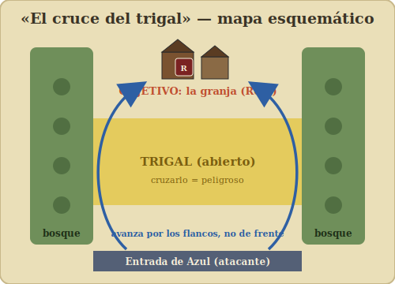

# 13 – Escenario de práctica: «El cruce del trigal»

[← Extras](index.md) · [📖 Reglamento completo](https://asantolaria.github.io/squad-leader/)

---

Este es un **escenario original** pensado para tu **primera partida**, solo con
**infantería**. No reproduce ningún escenario oficial: está diseñado desde cero para que
practiques movimiento, fuego, moral y avance sin abrumarte. Es ideal para
[jugar en solitario](12-jugar-en-solitario.md).

> **Materiales:** te vale **cualquier** tablero de *Squad Leader* (o uno improvisado) que
> tenga un **edificio o grupo de edificios** (el objetivo), una **franja de terreno abierto /
> trigal** delante, y algo de **bosque o setos** a los lados como cobertura. Las distancias
> que doy son aproximadas; ajústalas a tu mapa.

---

## La situación

Un pelotón reforzado **ataca** (lo llamaremos **Azul**) para tomar una pequeña **granja**
(uno o dos hexes de edificio) defendida por un puñado de hombres (**Rojo**). Entre el
atacante y la granja hay un **trigal abierto**: cruzarlo es el problema.

---

## Fuerzas (genéricas — usa las fichas que tengas)

**Azul (atacante):**

- **3 pelotones** de infantería (de potencia/moral media; p. ej. tipo "4-6-7").
- **1 líder** (p. ej. "9-1").
- **1 ametralladora** (LMG/MMG).

**Rojo (defensor):**

- **2 pelotones** de infantería.
- **1 líder** (p. ej. "8-0").
- **1 ametralladora**.

> El atacante tiene ventaja numérica (lo normal: atacar cuesta caro). Si quieres más reto
> para el atacante, dale al defensor un pelotón más o mejor cobertura.

---

## Despliegue

- **Rojo** se despliega **primero**, oculto si juegas con ocultación: reparte sus unidades
  **en y alrededor de la granja** (objetivo). Lo lógico: la MG + un líder en el edificio
  batiendo el trigal; un pelotón en cobertura a un flanco.
- **Azul** entra por el **borde opuesto** (al otro lado del trigal), o se despliega en la
  línea de bosque/setos de su lado.

---

## Reglas del escenario

- **Duración:** **6 turnos de juego**.
- **Iniciativa:** empieza **Azul** (es quien ataca).
- **Solo infantería** y armas de apoyo. Sin carros ni artillería.
- Usa todas las reglas de los capítulos [02](https://asantolaria.github.io/squad-leader/01-conceptos-basicos/#r4) a
  [06](https://asantolaria.github.io/squad-leader/06-terreno-avanzadas/).

## Condiciones de victoria

- **Azul gana** si al final del turno 6 tiene **al menos un pelotón en buena orden dentro de
  la granja** y **no** hay defensores en buena orden en ella.
- **Rojo gana** en cualquier otro caso (si aguanta la granja o si rompe el ataque).

---

## Tutorial: cómo afrontarlo (comentado)

No te voy a dar "la solución" (cada partida es distinta), sino **cómo pensar** cada fase,
aplicando lo aprendido. Sigue la [secuencia](https://asantolaria.github.io/squad-leader/01-conceptos-basicos/#r4).

### Turno 1 — Tantear y colocar fuego

- **Azul:** no cruces el trigal todavía. En **fuego preparado**, coloca tu **MG + líder** en
  un buen sitio con LOS a la granja y empieza a **hostigar** al defensor (forzar chequeos de
  moral). Con el resto, **muévete por los flancos** usando bosque/setos, sin exponerte al
  trigal.
- **Rojo (defensor):** **guarda** tu fuego. Tus blancos aún están a cubierto; no malgastes
  disparos. (Si juegas con el "cerebro automático" del cap. 12, no habrá ningún disparo
  bueno → no dispara.)

### Turno 2 — Ablandar al defensor

- **Azul:** sigue **fijando** con la MG. Si has llevado un pelotón a un flanco con LOS,
  **combina fuego** para romper a un defensor. Cada defensor **roto** es un fusil menos
  batiendo el trigal.
- **Rojo:** ahora sí, si un pelotón Azul asoma al trigal en movimiento, **dispárale** (blanco
  en movimiento al descubierto = tu mejor oportunidad).

### Turno 3 — El cruce (con cobertura o humo)

- **Azul:** este es el momento crítico. Si tienes mortero con **humo**, ciega la LOS de la MG
  enemiga y **cruza** el trigal. Si no, cruza por donde **menos** te vea el defensor, y
  **deja el último hex para la fase de avance** (que no provoca fuego). Recuerda:
  **dispérsate**, no cruces apilado.
- **Rojo:** dispara a quien cruce. Aquí decides el escenario: ¿gastas tu MG en el primer
  pelotón o esperas al grueso?

### Turnos 4–5 — Llegar al edificio y asaltar

- **Azul:** con tus pelotones ya cerca, usa la **fase de avance** para **entrar en el hex de
  la granja** y desencadenar el **combate cuerpo a cuerpo**: el fuego rara vez echa a quien
  está en un edificio, hay que **asaltarlo**. Lleva tu líder al asalto.
- **Rojo:** si te están desalojando, contraataca en cuerpo a cuerpo o repliega a un segundo
  edificio si lo hay.

### Turno 6 — Decisión

- Cuenta: ¿hay un pelotón Azul **en buena orden** en la granja y **ningún** Rojo en buena
  orden ahí? Azul gana. Si Rojo aguanta aunque sea con un medio pelotón, **resiste**.

---

## Qué deberías haber aprendido

- **No se cruza terreno abierto sin preparación:** primero fijas/rompes al defensor con
  fuego, luego cruzas con humo o por cobertura, y el último salto en **fase de avance**.
- **Combinar fuego** rompe; disparar suelto, no.
- **Los edificios se toman cuerpo a cuerpo**, no a tiros.
- **El defensor vive de guardar sus disparos** para el momento de máxima exposición.

> **Variantes para repetirlo:** añade un pelotón a cada bando; da humo al atacante; o cambia
> el objetivo (que Azul deba **salir** X pelotones por el borde de Rojo en vez de tomar la
> granja). Cada variante enseña algo distinto.

---

[← Extras](index.md) · [📖 Reglamento completo](https://asantolaria.github.io/squad-leader/)
